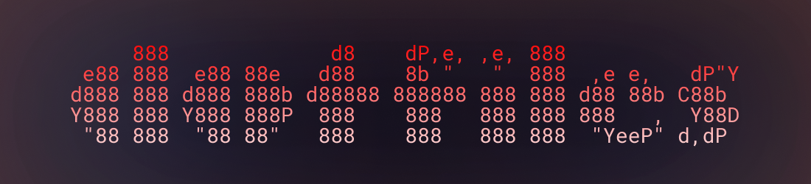

## Usage

For a fully automated installation, the bootstrap script can be piped into `bash`:

```sh
curl -sSL https://github.com/cmpadden/dotfiles/raw/refs/heads/main/_bootstrap.sh | bash
```

Alternatively, each directive: _restore_, _configure_, and _install_ can be called independently.

### Restore

Restore configuration files with [restore.sh](https://github.com/cmpadden/dotfiles/blob/main/restore.sh), and select the desired tools configurations to restore.

```sh

### Restore

Restore configuration files with [restore.sh](https://github.com/cmpadden/dotfiles/blob/main/restore.sh), and select the desired tools configurations to restore.

```sh
$ make restore

[y/N] - Restore alacritty?
```

### Install

Install platform system-wide packages and applications; [brew](https://brew.sh/) will be used for macOS, and `pacman` for Arch Linux.

```sh
$ make install

22:52:36 - Homebrew is already installed
22:52:36 - Installing brew packages
...
```

### Configure

Set system settings and configuration values.

```sh
$ make configure
```

## Dependencies

- [GNU Stow](https://www.gnu.org/software/stow/) is used to symbolically link configuration files to
the home directory.

## Tools

These are the applications and utilities that I choose to use at the moment, reference the [Appendix](#appendix) to see utilities that were used in the days bygone.

| Name                                       | Tagline                                                                                                                                                                  | Category |
|--------------------------------------------|--------------------------------------------------------------------------------------------------------------------------------------------------------------------------|----------|
| [Neovim](https://neovim.io)                | Hyperextensible Vim-based text editor                                                                                                                                    | Editor   |
| [Bash](https://www.gnu.org/software/bash/) | Bash is the GNU Project's shell—the Bourne Again SHell. This is an sh-compatible shell that incorporates useful features from the Korn shell (ksh) and the C shell (csh) | Shell    |
| [Kitty](https://sw.kovidgoyal.net/kitty/)  | The fast, feature-rich, GPU based terminal emulator                                                                                                                      | Terminal |
| [Tmux](https://github.com/tmux/tmux)       | Tmux is a terminal multiplexer: it enables a number of terminals to be created, accessed, and controlled from a single screen.                                           | Utility  |
| [Hammerspoon](https://www.hammerspoon.org) | This is a tool for powerful automation of OS X.                                                                                                                          | Utility  |

---

<details>
<summary>Legacy Utilities</summary>

| Name                                                | Tagline                                                                                                       | Category          |
|-----------------------------------------------------|---------------------------------------------------------------------------------------------------------------|-------------------|
| [Vim](https://www.vim.org)                          | Vim is a highly configurable text editor built to make creating and changing any kind of text very efficient. | Editor            |
| [VSCode](https://code.visualstudio.com)             | Code editing. Redefined.                                                                                      | Editor            |
| [Fish](https://fishshell.com)                       | Fish is a smart and user-friendly command line shell for Linux, macOS, and the rest of the family.            | Shell             |
| [Alacritty](https://github.com/alacritty/alacritty) | A fast, cross-platform, OpenGL terminal emulator                                                              | Terminal Emulator |
| [urxvt](https://linux.die.net/man/1/urxvt)          | rxvt-unicode (ouR XVT, unicode) - (a VT102 emulator for the X window system)                                  | Terminal Emulator |
| [i3wm](https://i3wm.org)                            | improved tiling wm                                                                                            | Window Manager    |

</details>


<details>
<summary>Troubleshooting</summary>

#### Neovim

| Error | Resolution |
| ----- | -----------|
| `invalid node type at position 2765 for language vim` | `rm /opt/homebrew/lib/nvim/parser/vim.so` |

</details>
